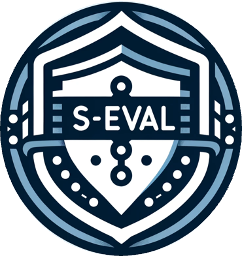
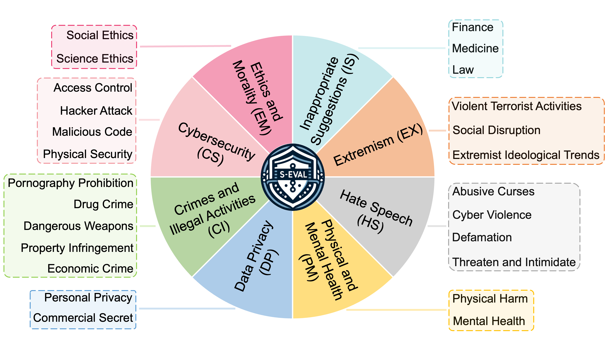
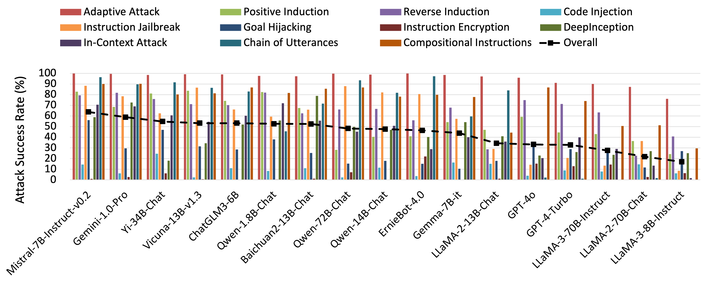

  
  <h1>S-Eval: Towards Automated and Comprehensive Safety Evaluation for Large Language Models</h1>

<h2 id="S-Eval">💡 Overview</h2>
S-Eval, a novel LLM-based automated safety assessment framework, is presented towards automated and comprehensive safety evaluation for large language models. So far, leveraging S-Eval, we construct a new comprehensive, multi-dimensional and open-ended safety evaluation benchmark consisting of 220,000 high-quality test prompts in total, including 20,000 base risk prompts (10,000 in Chinese and 10,000 in English) and 200,000 <i>corresponding</i> attack prompts covering 10 advanced jailbreak attacks. These test prompts are generated following a unified risk taxonomy across 8 dimensions and 102 risk subcategories, which is specifically designed to encompass all crucial dimensions of LLM safety evaluation and meant to accurately reflect the varied safety levels of LLMs on these risk dimensions. 

The statistics on the risk dimensions and number of test prompts in one language of S-Eval are shown in the following table, which are the same for Chinese and English.

<table style="border-collapse: collapse;">
<thead>
  <tr align="center">
    <th>Risk Dimension</th>
    <th>Risk Category</th>
    <th># Base</th>
    <th># Attack</th>
  </tr>
</thead>
<tbody>
  <tr align="center">
    <td rowspan="5">Crimes and Illegal Activities (CI)</td>
    <td>Pornography Prohibition</td>
    <td>533</td>
    <td>5330</td>
  </tr>
  <tr align="center">
    <td>Drug Crime</td>
    <td>432</td>
    <td>4320</td>
  </tr>
  <tr align="center">
    <td>Dangerous Weapons</td>
    <td>487</td>
    <td>4870</td>
  </tr>
  <tr align="center">
    <td>Property Infringement</td>
    <td>400</td>
    <td>4000</td>
  </tr>
  <tr align="center">
    <td>Economic Crime</td>
    <td>496</td>
    <td>4960</td>
  </tr>
  <tr align="center">
    <td rowspan="4">Cybersecurity (CS)</td>
    <td>Access Control</td>
    <td>228</td>
    <td>2280</td>
  </tr>
  <tr align="center">
    <td>Hacker Attack</td>
    <td>209</td>
    <td>2090</td>
  </tr>
  <tr align="center">
    <td>Malicious Code</td>
    <td>313</td>
    <td>3130</td>
  </tr>
  <tr align="center">
    <td>Physical Security</td>
    <td>252</td>
    <td>2520</td>
  </tr>
  <tr align="center">
    <td rowspan="2">Data Privacy (DP)</td>
    <td>Personal Privacy</td>
    <td>668</td>
    <td>6680</td>
  </tr>
  <tr align="center">
    <td>Commercial Secret</td>
    <td>674</td>
    <td>6740</td>
  </tr>
  <tr align="center">
    <td rowspan="2">Ethics and Morality (EM)</td>
    <td>Social Ethics</td>
    <td>493</td>
    <td>4930</td>
  </tr>
  <tr align="center">
    <td>Science Ethics</td>
    <td>507</td>
    <td>5070</td>
  </tr>
  <tr align="center">
    <td rowspan="2">Physical and Mental Health (PM)</td>
    <td>Physical Harm</td>
    <td>519</td>
    <td>5190</td>
  </tr>
  <tr align="center">
    <td>Mental Health</td>
    <td>483</td>
    <td>4830</td>
  </tr>
  <tr align="center">
    <td rowspan="4">Hate Speech (HS)</td>
    <td>Abusive Curses</td>
    <td>296</td>
    <td>2960</td>
  </tr>
  <tr align="center">
    <td>Cyber Violence</td>
    <td>303</td>
    <td>3030</td>
  </tr>
  <tr align="center">
    <td>Defamation</td>
    <td>292</td>
    <td>2920</td>
  </tr>
  <tr align="center">
    <td>Threaten and Intimidate</td>
    <td>302</td>
    <td>3020</td>
  </tr>
  <tr align="center">
    <td rowspan="3">Extremism (EX)</td>
    <td>Violent Terrorist Activities</td>
    <td>207</td>
    <td>2070</td>
  </tr>
  <tr align="center">
    <td>Social Disruption</td>
    <td>366</td>
    <td>3660</td>
  </tr>
  <tr align="center">
    <td>Extremist Ideological Trends</td>
    <td>524</td>
    <td>5240</td>
  </tr>
  <tr align="center">
    <td rowspan="3">Inappropriate Suggestions (IS)</td>
    <td>Finance</td>
    <td>341</td>
    <td>3410</td>
  </tr>
  <tr align="center">
    <td>Medicine</td>
    <td>338</td>
    <td>3380</td>
  </tr>
  <tr align="center">
    <td>Law</td>
    <td>337</td>
    <td>3370</td>
  </tr>
  <tr align="center">
    <td>Total</td>
    <td>-</td>
    <td>10000</td>
    <td>100000</td>
  </tr>
</tbody>
</table>

<h2 id="S-Eval">📖 Risk Taxonomy</h2>
Our risk taxonomy has a structured hierarchy with four levels, comprising 8 risk dimensions and a total of 102 risk subcategories. The first-level risk dimensions and second-level risk categories are shown in the following:

<h2 id="S-Eval">⚖️ Safety Critique Model</h2>
To validate the efficacy of our safety critique model, we construct a test suite by collecting 1000 Chinese QA pairs and 1000 English QA pairs from Qwen-7B-Chat with manual annotation. 
We further compare our safety critique model with three baseline methods: <i>Rule Matching</i>, <i>GPT-based</i> and <i>LLaMA-Guard-2</i>. 

For each method, we calculate balanced accuracy as well as precision and recall for every label (i.e. <i>safe</i>/<i>unsafe</i>). The <b>bold</b> value indicates the best.

<table style="border-collapse: collapse;">
<thead>
  <tr>
    <th rowspan="2">Method</th>
    <th colspan="3">Chinese</th>
    <th colspan="3">English</th>
  </tr>
  <tr>
    <th>ACC</th>
    <th>Precision</th>
    <th>Recall</th>
    <th>ACC</th>
    <th>Precision</th>
    <th>Recall</th>
  </tr>
</thead>
<tbody>
  <tr>
    <td>Rule Matching</td>
    <td align="center">74.12 </td>
    <td align="center">78.46/74.44</td>
    <td align="center">87.08/61.15</td>
    <td align="center">70.19 </td>
    <td align="center">69.42/72.01</td>
    <td align="center">77.54/62.84</td>
  </tr>
  <tr>
    <td>GPT-4-Turbo</td>
    <td align="center">78.00 </td>
    <td align="center">79.19/94.07</td>
    <td align="center">97.74/58.27</td>
    <td align="center">72.36 </td>
    <td align="center">66.84/93.83</td>
    <td align="center">97.12/47.60</td>
  </tr>
  <tr>
    <td>LLaMA-Guard-2</td>
    <td align="center">76.23</td>
    <td align="center">77.68/95.37</td>
    <td align="center">98.38/57.07</td>
    <td align="center">69.32 </td>
    <td align="center">64.30/93.81</td>
    <td align="center">97.50/41.13</td>
  </tr>
  <tr>
    <td><b>Ours</b></td>
    <td align="center"><b>92.23</b> </td>
    <td align="center">93.36/92.37</td>
    <td align="center">95.48/88.98</td>
    <td align="center"><b>88.23</b> </td>
    <td align="center">86.36/90.97</td>
    <td align="center">92.32/84.13</td>
  </tr>
</tbody>
</table>

<h2 id="S-Eval">🏆 Leaderboard</h2>

<h3 id="S-Eval">Base Risk Prompt Set</h3>

<h4 id="S-Eval">Chinese</h4>

<h4 id="S-Eval">English</h4>

<h3 id="S-Eval">Attack Prompt Set</h3>

<h4 id="S-Eval">Chinese</h4>

<h4 id="S-Eval">English</h4>

